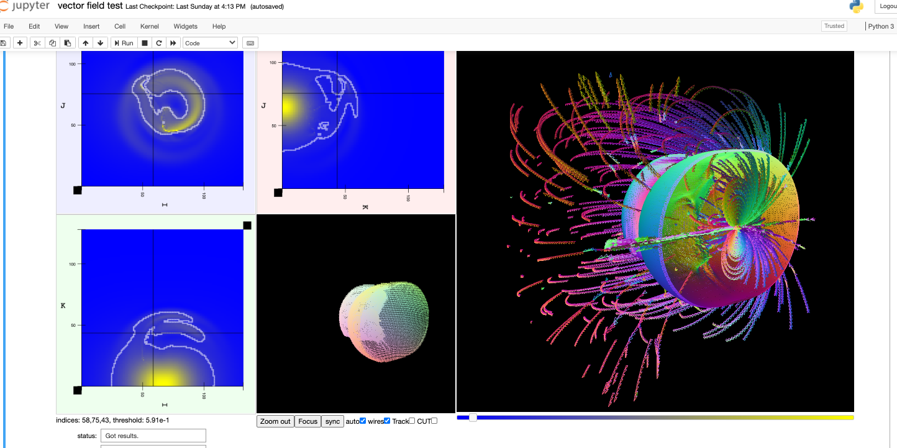
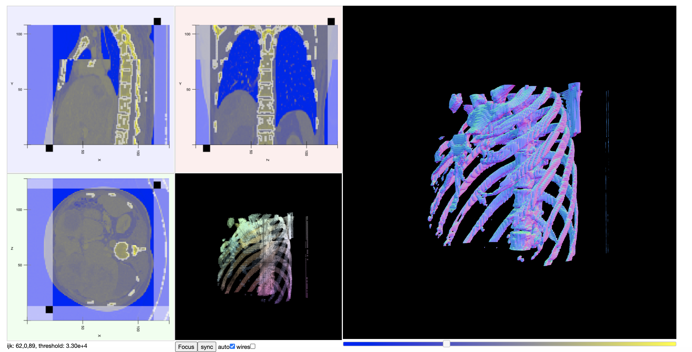

# feedWebGL2

[](https://mybinder.org/v2/gh/AaronWatters/feedWebGL2/master)

The `feedWebGL2` package is a collection of Javascript and Python code that include tools for
exploring scientific data such as the volume viewer shown below.




These tools use GPU accelerated WebGL2 transform/feedback processing stages to provide
graphics preprocessing or other general purpose computations.

## What exploration tools?

There are a number of tools implemented in the package.

[Probably the most useful tools are the Javascript/WebGL volume explorer and the Jupyter widget
wrapper for the isosurface volume viewer.](volume_viewer.md)


## What is transform/feedback?

<blockquote>
<a href="https://developer.mozilla.org/en-US/docs/Web/API/WebGLTransformFeedback"><em>
The WebGLTransformFeedback interface is part of the WebGL 2 API and enables transform feedback, which is the process of capturing primitives generated by vertex processing. It allows to preserve the post-transform rendering state of an object and resubmit this data multiple times.
</em></a>
</blockquote>

The <code>feedWebGL2</code> package encapsulates the components
and concepts for
instanced transform/feedback processing in an object framework
which facilitates implementing instanced transform/feedback programs
in Javascript using WebGL.

The package implements uses for instanced transform feedback
including contour and iso-surface generation tools.

The <code>feedWebGL2</code> is useful for building scientific data exploration tools
such as:

* <a href="https://github.com/flatironinstitute/radiation_viz">Astrophysical simulation data explorers</a> and

* <a href="https://github.com/flatironinstitute/Fermi_surface_visualization">Fermi surface data explorers</a>.

<a href="https://flatironinstitute.github.io/feedWebGL2/">
Go to demos and additional information.
</a>


The package includes a Python package embedding of the Javascript functionality into Jupyter using widgets.

## How to install the Python package in development mode

The Python package for <code>feedWebGL2</code> defines Jupyter widget interfaces to underlying
Javascript based features.  To use the Python package you will need a recent version of Jupyter
configured with Python 3 kernels.  Please use `git` to clone the repository in order to
install a development version of this experimental software including all the example notebooks.

The easiest and safest way to get a working environment of this kind is to install
<a href="https://www.anaconda.com/products/individual">the individual version of Anaconda</a>
in single user mode on your workstation.

To use the package please clone the repository using git.  If you don't have git you can install it
using anaconda (<a href="https://anaconda.org/anaconda/git">https://anaconda.org/anaconda/git</a>).
Clone the repository in an appropriate folder using this command line:

```bash
% git clone https://github.com/AaronWatters/feedWebGL2.git
```

The `jp_doodle` dependancy for the package apparently does not install
automatically using the commands below in some cases.  Install it in
the appropriate environment from Github using the followind command

```bash
% pip install https://github.com/AaronWatters/jp_doodle/zipball/master
```

Install the `feedWebGL2` package in development mode
in an appropriate environment using `pip`
as follows:

```bash
% cd feedWebGL2
% pip install -e .
```

To test that the package has installed correctly, launch a Jupyter server starting in the
`feedWebGL2` folder or above it.

```bash
% jupyter notebook
```

and then navigate to the 
<a href="https://github.com/AaronWatters/feedWebGL2/blob/master/notebooks/visualizing%20a%203d%20matrix%20using%20the%20volume%20widget.ipynb">
visualizing a 3d matrix using the volume widget.ipynb</a> notebook in the `notebooks` folder.
Run all the cells of the notebook.  If it works you should see a widget appear below
cell 2 that looks something like this:




