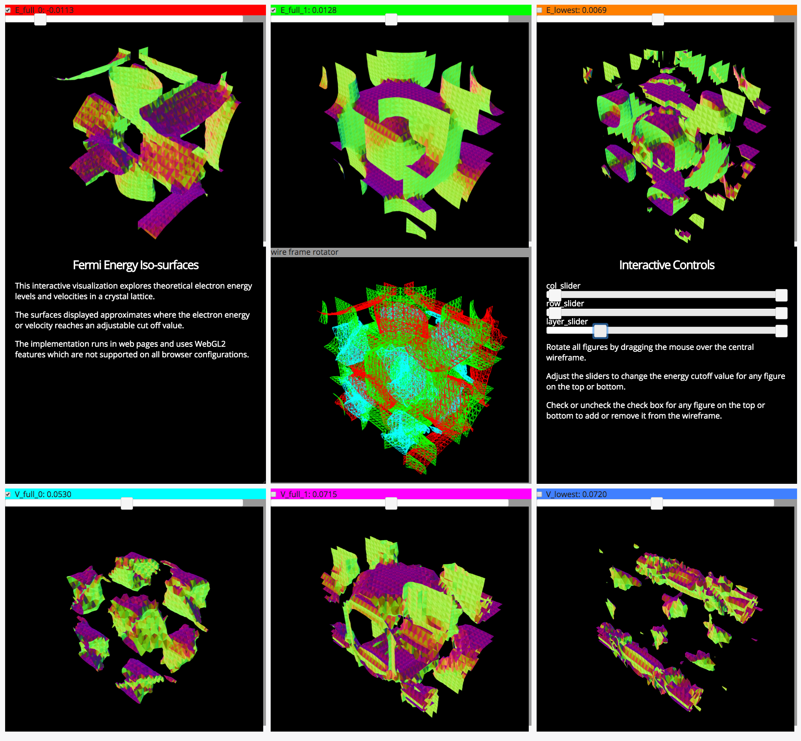

# feedWebGL2
Tools for implementing WebGL2 feedback processing stages for graphics preprocessing or other purposes

<blockquote>
<a href="https://developer.mozilla.org/en-US/docs/Web/API/WebGLTransformFeedback"><em>
The WebGLTransformFeedback interface is part of the WebGL 2 API and enables transform feedback, which is the process of capturing primitives generated by vertex processing. It allows to preserve the post-transform rendering state of an object and resubmit this data multiple times.
</em></a>
</blockquote>

The <code>feedWebGL2</code> package encapsulates the components
and concepts for
instanced transform/feedback processing in an object framework
which facilitates implementing instanced transform/feedback programs
in Javascript using WebGL.

The package implements uses for instanced transform feedback
including contour and iso-surface generation tools.

<a href="https://flatironinstitute.github.io/feedWebGL2/">
Go to demos and additional information.
</a>

<a href="https://flatironinstitute.github.io/feedWebGL2/Fermi_Surfaces.html">
Screen shot from the Fermi iso-surfaces example.
</a>
