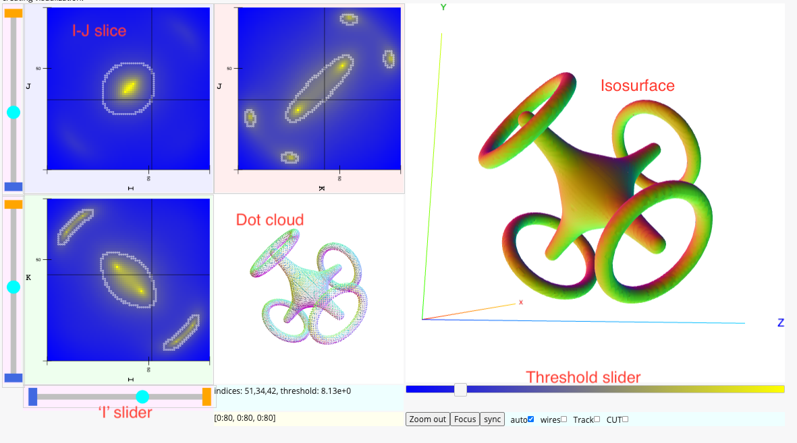
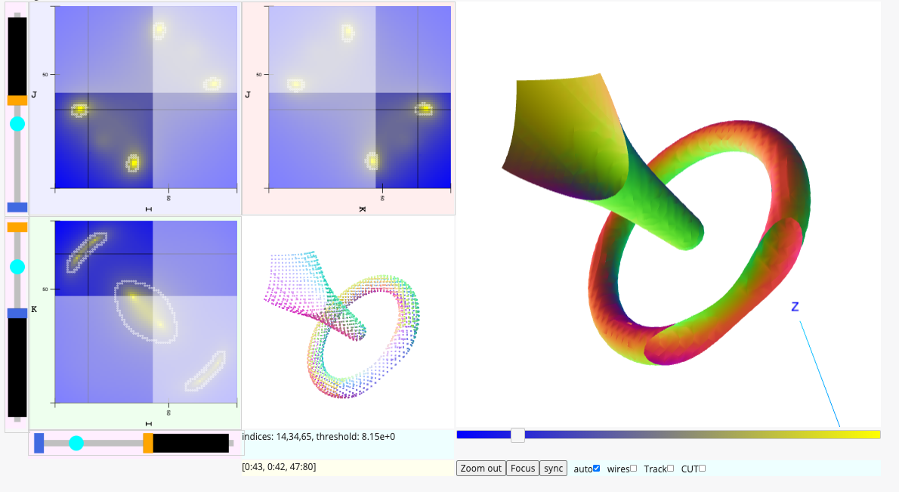

# Volume viewer

The volume viewer interface allows the user to explore a dense three dimensional array of values.
Using numeric python notation these arrays store floating values using three indices, like this:

```Python
ijk_value = dense_array[i, j, k]
```

where `ijk_value` gives a floating point scalar value.

It is hoped that by interacting with the controls
and examining the views the user will gain insight into the geometric
and mathematical properties of the array.

This document describes the viewer, its interactive controls, and the interface
for creating a viewer.
<a href="README.md">
Please see the repository README for information on how to install the feedWebGL package
which includes the viewer software.
</a>

## The presentation

The viewer presents three kinds of views of the volume: two dimensional slices (I-J, I-K, and J-K),
a three dimensional isosurface solid view, and an isosurface dot cloud view.  In addition to the views the
viewer provides a number of interactive controls and mouse interactions which allow the user
to change the volume views.  It is hoped that by interacting with the controls
and examining the views the user will gain insight into the mathematical and geometric
characteristics of the volume data.

At all times the presentation records an isosurface threshold value and an IJK index focus point.
In the image below the threshold is 8.13 and the IJK focus is (51, 34, 42).

## I-J, I-K, and J-K slices

The slices show value intensities slicing through the array at the focus point.  
In the example below
the I-J slice show the intensities in the array where the K value is fixed at 42.  The blue
pixels indicate small array values and the yellow points indicate high array values.

## The isosurface solid

The isosurface solid view presents a three dimensional surface where the
array "attains the threshold value".  
In the example below the isosurface represents the surface where the array
"attains the value 8.13."
It is more precise to say that the iso-surface solid is interpolated
within each voxel of the array which crosses the threshold value.  

In a medical MRI
volume of a human body an iso-surface at a high threshold might outline the bones
and other hard features
in the volume, and an iso-surface at a lower value might outline the lungs and skin and
other soft tissues.

## The dot cloud

The dot cloud is an alternative view of the iso-surface which presents the interpolation
points of the surface without joining them into a solid figure.  This allows the
user to "see through" the figure.

The image below is a screen shot of the volume viewer displaying a volume which would be
difficult to interpret using only two dimensional projections.

## Screenshot

The following screenshot shows 
<a href="https://aaronwatters.github.io/feedWebGL2/torus_html/volume.html" target="_blank" >
a "standalone HTML" instance of the volume viewer published on github pages
at the web location "aaronwatters.github.io/feedWebGL2/torus_html/volume.html".</a>
The code for creating the demo is in the notebook
<a href="https://github.com/AaronWatters/feedWebGL2/blob/master/notebooks/star%20with%20toruses.ipynb">
/notebooks/star with toruses.ipynb
</a> in the repository.



### Controls

The user can change the volume view presentation using a number of mouse interactions.

### Slicing



### Making a viewer in a Jupyter notebook

### Making a "stand alone HTML viewer"