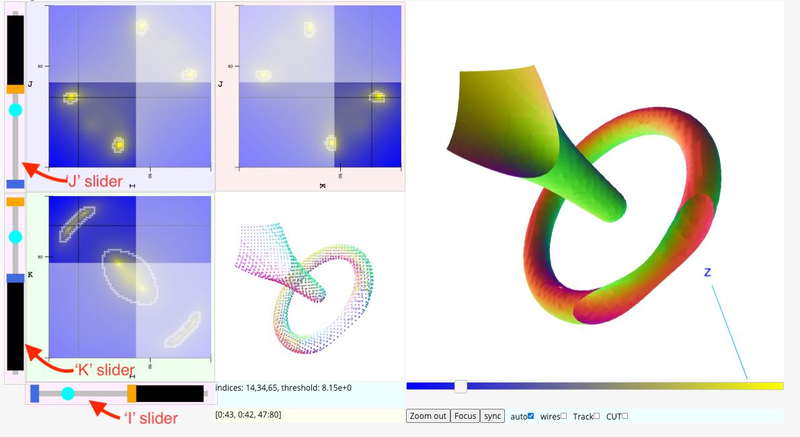

# Volume viewer

The volume viewer interface allows the user to explore a dense three dimensional array of values.
Using numeric python notation these arrays store floating values using three indices, like this:

```Python
ijk_value = dense_array[i, j, k]
```

where `ijk_value` gives a floating point scalar value.

It is hoped that by interacting with the controls
and examining the views the user will gain insight into the geometric
and mathematical properties of the array.

This document describes the viewer, its interactive controls, and the interface
for creating a viewer.
<a href="README.md">
Please see the repository README for information on how to install the feedWebGL package
which includes the viewer software.
</a>

## The presentation

The viewer presents three kinds of views of the volume: two dimensional slices (I-J, I-K, and J-K),
a three dimensional isosurface solid view, and an isosurface dot cloud view.  In addition to the views the
viewer provides a number of interactive controls and mouse interactions which allow the user
to change the volume views.  It is hoped that by interacting with the controls
and examining the views the user will gain insight into the mathematical and geometric
characteristics of the volume data.

At all times the presentation records an isosurface threshold value and an IJK index focus point.
In the image below the threshold is 8.13 and the IJK focus is (51, 34, 42).

## I-J, I-K, and J-K slices

The slices show value intensities slicing through the array at the focus point.  
In the example below
the I-J slice show the intensities in the array where the K value is fixed at 42.  The blue
pixels indicate small array values and the yellow points indicate high array values.

## The isosurface solid

The isosurface solid view presents a three dimensional surface where the
array "attains the threshold value".  
In the example below the isosurface represents the surface where the array
"attains the value 8.13."
It is more precise to say that the iso-surface solid is interpolated
within each voxel of the array which crosses the threshold value.  

In a medical MRI
volume of a human body an iso-surface at a high threshold might outline the bones
and other hard features
in the volume, and an iso-surface at a lower value might outline the lungs and skin and
other soft tissues.

## The dot cloud

The dot cloud is an alternative view of the iso-surface which presents the interpolation
points of the surface without joining them into a solid figure.  This allows the
user to "see through" the figure.

The image below is a screen shot of the volume viewer displaying a volume which would be
difficult to interpret using only two dimensional projections.

## Screenshot

The following screenshot shows 
<a href="https://aaronwatters.github.io/feedWebGL2/torus_html/volume.html" target="_blank" >
a "standalone HTML" instance of the volume viewer published on github pages
at the web location "aaronwatters.github.io/feedWebGL2/torus_html/volume.html".</a>
The code for creating the demo is in the notebook
<a href="https://github.com/AaronWatters/feedWebGL2/blob/master/notebooks/star%20with%20toruses.ipynb">
/notebooks/star with toruses.ipynb
</a> in the repository.


## Controls

The user can change the volume view presentation using a number of mouse interactions.

**Rotate** both the isosurface and dot cloud views by **dragging the mouse over the dot cloud**.

**Change the threshold** without changing the IJK focus by **adjusting the threshold slider**.

**Change the threshold and the IJK focus** by **clicking** on any of the IJ, JK, or IK slice views.

Adjust the three dimensional camera to fit the current isosurface using the **Focus** button.

Restore the three dimensional camera to the default using the **Zoom out** button.

Restrict the volume view to an isolated surface component by **selecting the CUT** checkbox
and then clicking on a voxel of the component in the slice views.

**Dynamically change the threshold and the IJK focus** by **selecting the Track checkbox** and then
mousing over the IJ, JK, or IK slice views.  Restore normal mode by clicking on a slice view.

### Slicing

It is possible to view a sub-section of the whole volume by adjusting the I, J, and K sliders.
In the image below the user has selected to view the subsection 
described by the numeric python slicing notation `Array[0:43, 0:42, 47:80]`.



Move the lower and upper boundary rectangles in the sliders to bound the sub-volume of interest.

### Disabling automatic syncing

By default the three dimensional views sync automatically with the two dimensional slices and other
controls.  For larger arrays the 3d rendering may become cumbersomely slow, and this can make the
tool difficult to use.  **Uncheck the auto checkbox** to decouple the 3d rendering from the other controls.
To sync the 3d views with the current settings **press the sync button**.

### Wireframe mode

**Check the wires checkbox** to enable a wireframe view of the isosurface render area.  The wireframe
view can allow the user to see through the figure to some extent in order to see internal features
which are obscured in a solid render.

# Creating a viewer

There are a number of ways to create a volume viewer.  The text below describes how to create a
viewer in a Jupyter widget, or as a stand alone HTML page using Python.

### Making a viewer in a Jupyter notebook

The `volume` module allows the user to display a volume viewer as a Jupyter widget
within a Jupyter notebook.  The following interaction displays a
numeric Python array `A` in a volume
viewer using the default settings.

```Python
from feedWebGL2 import volume

volume.widen_notebook()

W = volume.Volume32()

W.load_3d_numpy_array(
    A, 
    #threshold=0.5 * (A.max() + A.min()), 
    #di=dict(x=1, y=0, z=0),  # xyz offset between ary[0,0,0] and ary[1,0,0]
    #dj=dict(x=0, y=2, z=0),  # xyz offset between ary[0,0,0] and ary[0,1,0]
    #dk=dict(x=0, y=0, z=1),  # xyz offset between ary[0,0,0] and ary[0,0,1]
)

x = W.build(1500)
```

The commented lines show some override settings which will specify the initial threshold
for the isosurface, and set the projection of the J offset into the Y component of the 
three dimensional view to twice the I and J offsets.  The `di, dj, dk` arguments can also
switch axes assignments.  Please see
<a href="https://github.com/AaronWatters/feedWebGL2/blob/master/feedWebGL2/volume.py">
the volume.py source code
</a>
for additional options.  The `build` method builds the widget setting the widget width to 1500 pixels.

It may be useful to use the volume viewer to extract a sub-volume of interest
for downstream processing.
The
```
Slicing = W.current_array_slicing()
```
method will extract the currently viewed slicing for the volume widget `W` corresponding to
the slice slider settings.

### Making a "stand alone HTML viewer"

The `html_generator` module builds a file system folder containing all components
needed for a stand alone web page containing a volume viewer.

The following script will create a folder `../doc/test_torus_html`
containing the "main" page `../doc/test_torus_html/volume.html` which
presents a volume viewer for the the numeric Python array `A`.

```Python
target_folder = "../doc/test_torus_html"

from feedWebGL2 import html_generator

html_generator.generate_volume_html(
    A, 
    target_folder, 
    force=False, 
    width=1500,
    #threshold=0.5 * (A.mean() + A.min()), 
    #di=dict(x=1, y=0, z=0),  # xyz offset between ary[0,0,0] and ary[1,0,0]
    #dj=dict(x=0, y=2, z=0),  # xyz offset between ary[0,0,0] and ary[0,1,0]
    #dk=dict(x=0, y=0, z=1),  # xyz offset between ary[0,0,0] and ary[0,0,1]
)
```

The `volume.html` page must be viewed using an HTTP server (not via the `file:` protocol)
due to web browser security defaults.  For testing and development you can start a simple
web server in a folder above the generated folder as follows:

```bash
$ python -m http.server
Serving HTTP on 0.0.0.0 port 8000 (http://0.0.0.0:8000/) ...
```

After starting the server navigate to the `volume.html` page in a web browser from the
server root URL (here `http://0.0.0.0:8000/`).

### Other techniques

It is also possible to build volume viewers in to web interfaces using other methods.
Please examine the source code for the standard generators and the volume component
for insight on how to do this.  If you have questions or special requests, please post
an issue to the repository.

### Array size issues

The volume viewer may not work well for arrays that are oddly shaped or that are too large.

It may be possible to make the viewer work better for oddly shaped arrays by adjusting the
`di, dj, dk` transformation vectors shown above to remove the distortion.  

On my laptop
arrays that are significantly larger than shape `(100, 100, 100)` can cause the viewer
to have performance issues.   To get around these issues you can disable auto-sync as described
above or you can 
view a subsample the large array for previewing and focus in to a subsection of
interest in a separate presentation, among other possibilities.


